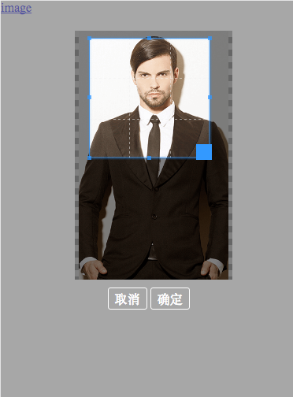

# qiniu-crop-upload-image
**Install**
`
    npm i qiniu-crop-upload-image --save
`   
**Usage**
```
    var crop=require('qiniu-crop-upload-image');
    var options = {
        debug: true,
        measure:1,//box measure
        qiniu_token_url: '',// like /api/qiniu/get-token
        qiniu_res_root: '',// like http://7xt6dfp.com1.z0.glb.clouddn.com/
    };
    crop.init(options, (imageSrc)=> {
        console.log(imageSrc)//the image-url your need
    });
 
    //start
    document.getElementById('pick').onclick = ()=> {
        crop.start();
    };

```

Or
`
    <script src="./dist/bundle.js"></script>
`